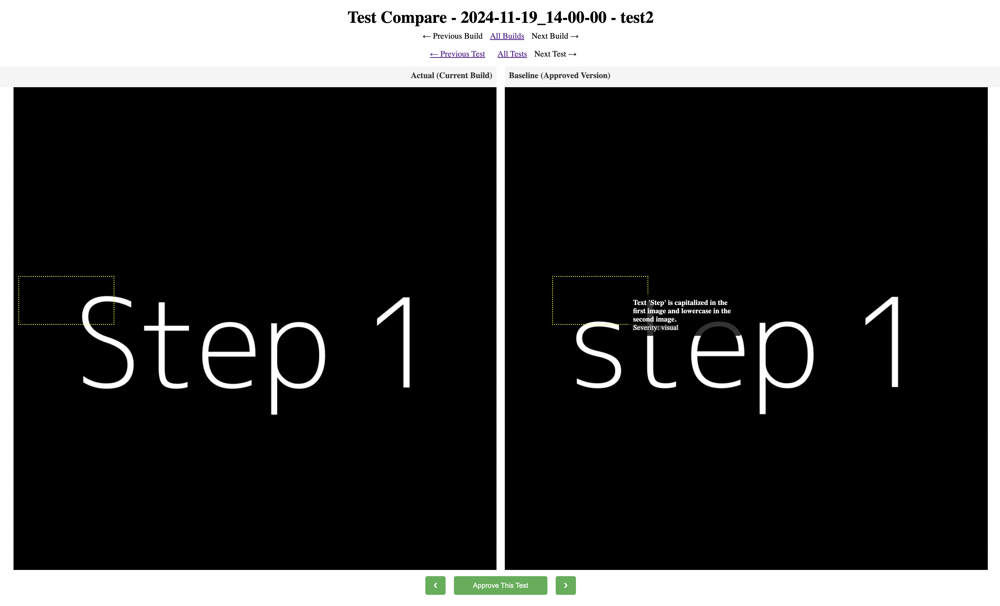

# E2E Screenshot Viewer

A simple app to view and approve screenshots for your E2E tests.

## How it works
1. Open the web interface
2. Log in using basic authentication, find initial credentials in .env
3. Browse screenshots by builds and tests
4. Use carousels to compare current screenshots with baselines
5. Approve changes



## How to Use

### On your server
1. Copy `.env` and `docker-compose.yml` files from the repository
2. Set valid credentials and ports
3. Launch the application:

```bash
docker compose up
```

### In E2E Tests
1. Upload screenshots using the HTTP API:

```bash
# Successful test example
curl -X POST \
  "http://your-server/api/builds/build-123/tests/login-test/upload?name=step1.png" \
  -H "Authorization: Basic $(echo -n 'user:pass' | base64)" \
  -F "screenshot=@./path/to/screenshot.png"

# Failed test example
curl -X POST \
  "http://your-server/api/builds/build-123/tests/FAILED-login-test/upload?name=error-state.png" \
  -H "Authorization: Basic $(echo -n 'user:pass' | base64)" \
  -F "screenshot=@./path/to/error-screenshot.png"
```

2. Failed tests will be prefixed in the UI if the test folder name starts with "FAILED-"

```
screenshots/
  ├── build-123/
  │   ├── FAILED-login-test/
  │   │   ├── error-state.png
  │   │   └── initial-state.png
  │   └── signup-test/
  │       └── success.png
```

### Debugging

1. Run `docker compose up minio` to start MinIO server
2. Run `npm ci` to install dependencies
3. Run `npm run seed:minio` to import some screenshots
4. Run `npm run start:dev` to start the application
5. Open `http://localhost:4000` in your browser

### Publishing Docker Image

```bash
docker login docker.io --username melnikaite
docker buildx create --use
docker buildx build --platform linux/amd64,linux/arm64 \
  -t docker.io/melnikaite/e2e-screenshot-viewer:latest \
  --push .
```
